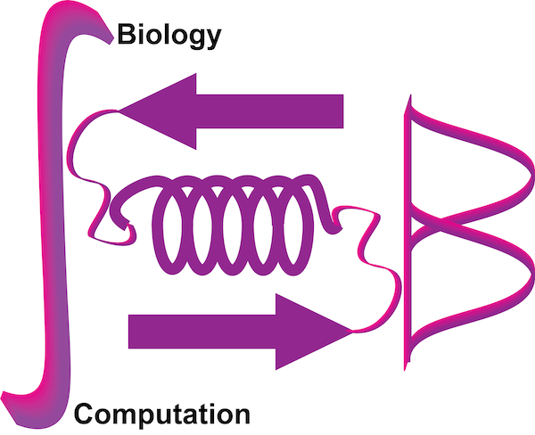

  

{:style="display: block; margin-left: auto; margin-right: auto; max-height=20%; max-width=20%"}

 

We are an interdisciplinary computational structural biology group in [NCBS-TIFR](https://www.ncbs.res.in/), Bangalore.

Broadly, we seek to understand how proteins are organized in cells. We do this by characterizing structures of proteins at multiple scales, ranging from binary complexes to macromolecular assemblies and nanoscale architectures. These structures are key to understanding the mechanistic details of cellular processes in normal and disease states. They provide answers to questions such as: How do these molecular machines function? How did they evolve? How are they assembled and regulated in the cell? What do they tell us about basic architectural design principles in biology?

One focus of our group is to develop rigorous methods and software for computational modeling of protein organization. We’re inspired by algorithms from computational statistics, statistical physics, machine learning and optimization, computer vision, and graph theory. We aim to produce algorithms and software that we and others can use.

Another focus lies in characterizing the structures and functions of specific assemblies in close collaborations with (experimental) cell and structural biologists.

<!-- ## Upcoming events -->
## News

- [Disobind](https://doi.org/10.1016/j.cels.2025.101486), our method for predicting IDR binding sites, is out! Check out the [Cell Systems preview](https://doi.org/10.1016/j.cels.2025.101508) and the [NCBS Research Explained article](https://news.ncbs.res.in/research-explained/how-scientists-predict-what-shapeless-proteins-do).
- Join us for the upcoming workshop on integrative modeling organized by ISB Lab at NCBS as part of the [Model building, Refinement and Validation workshop](https://www.ncbs.res.in/events/cryo-em) in March 2026!
- We will also be organizing a tutorial and lecture on deep learning with protein language models as part of the [EMBO Workshop on AI-driven approaches in structural biology](https://sites.google.com/view/embo-workshop-iisc-2026/home) in April 2026.

## Join us!

- New graduate programs at NCBS: Check out the [Physics of Life](https://pol.ncbs.res.in/) program for students from Phy/Chem/Math/CS backgrounds.
- New [AI in biology postdoctoral fellowship program](https://www.ncbs.res.in/academic/postdoc-calibre-ai-in-biology-postdoctoral-fellowship-program) at NCBS!
- Check out the [Opportunities](/Opportunities) page for more details.

## Contact

We are at Lab 15, ELC 1st floor in NCBS.

**Address**: National Center for Biological Sciences (NCBS), 
Tata Institute for Fundamental Research (TIFR), 
GKVK, Bellary Road, Bangalore, India 560065  

**Phone**: +91-080-6717-6152   
**Email**: shruthiv AT ncbs DOT res DOT in   
**Twitter**: @shruthiLab   
