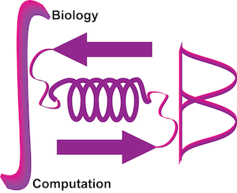

  

{:style="display: block; margin-left: auto; margin-right: auto; max-height=20%; max-width=20%"}

 

We are an interdisciplinary computational structural biology group in [NCBS-TIFR](https://www.ncbs.res.in/), Bangalore.

Broadly, we seek to understand how proteins are organized in cells. We do this by characterizing structures of proteins at multiple scales, ranging from binary complexes to macromolecular assemblies and nanoscale architectures. These structures are key to understanding the mechanistic details of cellular processes in normal and disease states. They provide answers to questions such as: how do these molecular machines function? How did they evolve? How are they assembled and regulated in the cell? What do they tell us about basic architectural design principles in biology?

One focus of our group is to develop rigorous methods and software for computational modeling of protein organization. We’re inspired by algorithms from computational statistics, statistical physics, machine learning and optimization, computer vision, and graph theory. We aim to produce algorithms and software that we and others can use.

Another focus lies in characterizing the structures and functions of specific assemblies in close collaborations with (experimental) cell and structural biologists.

 

<!-- ## Upcoming events -->
## News
1. Shreyas will be presenting a flash talk on his new method for unsupervised particle identification in cryo-electron tomograms at the [EMBO in situ structural biology workshop 2025](https://www.embl.org/about/info/course-and-conference-office/events/iss25-01/). He also received a travel award from EMBO for the meeting!
2. Kartik and Shruthi obtained travel awards from the Biophysical Society to attend the [Annual Meeting 2025](https://www.biophysics.org/2025meeting/general-info)!
3. Our desmosome study was featured in the cover of the Protein Science [Jan 2025 issue](https://onlinelibrary.wiley.com/toc/1469896x/current)!
 

## Join us!
Interested in collaborating with us or joining us? Please get in touch. Also check out the [Opportunities](/Opportunities) page.
 

## Contact

We are at Lab 15, ELC 1st floor in NCBS.

**Address**: National Center for Biological Sciences (NCBS), 
Tata Institute for Fundamental Research (TIFR), 
GKVK, Bellary Road, Bangalore, India 560065  

**Phone**: +91-080-6717-6152   
**Email**: shruthiv AT ncbs DOT res DOT in   
**Twitter**: @shruthiLab   
